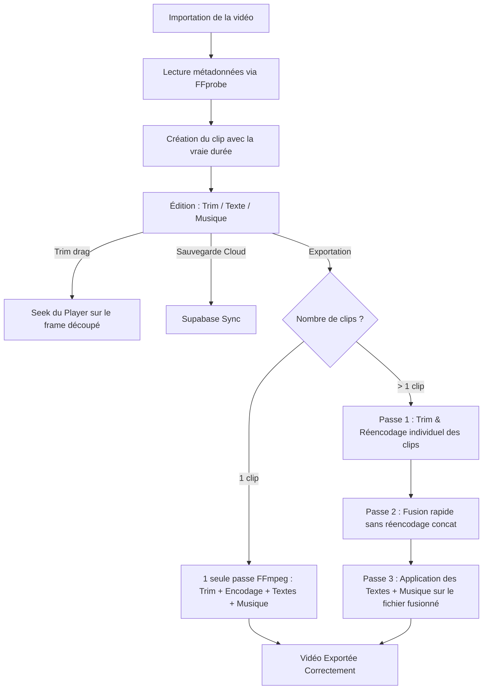

# Walkthrough — Résolution des Problèmes Fonctionnels

Ce document récapitule les modifications effectuées pour résoudre les problèmes fonctionnels d'EmpireCut.

---

## Changements Effectués

### 1. Fix de l'encodage FFmpeg (`h264_mediacodec`)
* **Fichier modifié** : [commands.ts](file:///c:/Users/teemm/reacte_projets/EmpireCut/src/ffmpeg/commands.ts)
* **Action** : Remplacement de l'option non gérée `-q:v` par `-b:v` (bitrate constant) pour toutes les commandes utilisant `videoEncodeArgs`. Nous avons défini des bitrates cibles pour contrôler la qualité sans faire crasher l'encodeur matériel Android :
  * Low : `1.5M`
  * Medium : `3.0M`
  * High : `6.0M`

### 2. Ajout de la police pour les overlays texte
* **Fichier modifié** : [commands.ts](file:///c:/Users/teemm/reacte_projets/EmpireCut/src/ffmpeg/commands.ts)
* **Action** : Ajout du paramètre `fontfile='/system/fonts/Roboto-Regular.ttf'` sur Android (et fallback standard sur iOS). Sans ce chemin, FFmpeg ne trouvait pas de police de rendu et plantait.

### 3. Utilisation de `-filter_complex` unifié
* **Fichier modifié** : [commands.ts](file:///c:/Users/teemm/reacte_projets/EmpireCut/src/ffmpeg/commands.ts)
* **Action** : Suppression du mélange instable de `-vf` et `-filter_complex`. Les filtres de mise à l'échelle (scale), les overlays texte (drawtext) et le mixage audio (amix) sont désormais tous chaînés proprement dans un seul `-filter_complex` unifié.

### 4. Support des Overlays & Musique dans l'exportation multi-clips
* **Fichier modifié** : [ExportScreen.tsx](file:///c:/Users/teemm/reacte_projets/EmpireCut/src/screens/ExportScreen.tsx)
* **Action** : Ajout d'une étape finale d'encodage (Step 3) après la fusion des clips (demux concat) s'il y a des overlays ou de la musique de fond. Cette étape exécute `buildExportCommand` sur le fichier fusionné pour y appliquer tous les éléments de composition.

### 5. Correction du TrimEnd et ajout du retour visuel
* **Fichier modifié** : [EditorScreen.tsx](file:///c:/Users/teemm/reacte_projets/EmpireCut/src/screens/EditorScreen.tsx)
* **Action** :
  * Correction du bug majeur où `handleTrimEndChange` écrasait `trimStart` au lieu de `trimEnd`.
  * Ajout d'un appel à `setCurrentTime` pour déplacer automatiquement la tête de lecture vers le point de découpe (début ou fin) pendant la manipulation des curseurs de trim.

### 6. Robustesse à l'importation de vidéo (FFprobe)
* **Fichier modifié** : [useVideo.ts](file:///c:/Users/teemm/reacte_projets/EmpireCut/src/hooks/useVideo.ts)
* **Action** : Ajout d'un appel à `ffmpegService.getMediaInfo(readableUri)` (FFprobe) après la copie locale du fichier vidéo pour extraire précisément la durée, la largeur et la hauteur, même si le module `react-native-image-picker` retourne `0` ou `undefined` sur Android.

### 7. Résolution de l'erreur "Filter not found" (Suppression du filtre `null`)
* **Fichier modifié** : [commands.ts](file:///c:/Users/teemm/reacte_projets/EmpireCut/src/ffmpeg/commands.ts)
* **Action** : Suppression du filtre `null` utilisé comme passthrough final dans le filtre complexe vidéo. Ce filtre n'étant pas disponible dans certains builds mobiles de FFmpegKit, il provoquait une erreur d'initialisation du pipeline. À la place, nous mappons directement le dernier label de filtre vidéo disponible (`currentVideoLabel`), ce qui est plus simple, standard et performant.

---

## Session 2 — Nettoyage ESLint & TypeScript

**Résultat** : `0 erreurs ESLint`, `0 erreurs TypeScript` sur l'ensemble du codebase.

### Fichiers corrigés

| Fichier | Type de correction |
|---|---|
| [TimelineBar.tsx](file:///c:/Users/teemm/reacte_projets/EmpireCut/src/components/timeline/TimelineBar.tsx) | Suppression des imports inutilisés (`FontSize`), suppression de `handleSeek`, `index`, `thumbInterval` |
| [TimelineThumbnail.tsx](file:///c:/Users/teemm/reacte_projets/EmpireCut/src/components/timeline/TimelineThumbnail.tsx) | Suppression de l'import inutilisé `BorderRadius` |
| [VideoPlayer.tsx](file:///c:/Users/teemm/reacte_projets/EmpireCut/src/components/video/VideoPlayer.tsx) | Suppression des imports inutilisés `SCREEN_WIDTH`, `Dimensions`, état `duration`/`setDuration` |
| [commands.ts](file:///c:/Users/teemm/reacte_projets/EmpireCut/src/ffmpeg/commands.ts) | Suppression de l'import inutilisé `MergeParams` |
| [useTimeline.ts](file:///c:/Users/teemm/reacte_projets/EmpireCut/src/hooks/useTimeline.ts) | Ajout `eslint-disable` pour dépendance `zoom` intentionnelle dans `useMemo` |
| [AppNavigator.tsx](file:///c:/Users/teemm/reacte_projets/EmpireCut/src/navigation/AppNavigator.tsx) | Ajout `eslint-disable` pour composant imbriqué dans `tabBarIcon` |
| [EditorScreen.tsx](file:///c:/Users/teemm/reacte_projets/EmpireCut/src/screens/EditorScreen.tsx) | Suppression des imports `useProject`, `Clip`, `ClipRow`, correction du shadowing de `addTextOverlay`/`setMusicTrack`, ajout des dépendances manquantes au `useEffect` |
| [ExportScreen.tsx](file:///c:/Users/teemm/reacte_projets/EmpireCut/src/screens/ExportScreen.tsx) | Suppression de `SCREEN_WIDTH`/`Dimensions`, variable `error` inutilisée, style inline remplacé par StyleSheet |
| [HomeScreen.tsx](file:///c:/Users/teemm/reacte_projets/EmpireCut/src/screens/HomeScreen.tsx) | Suppression des imports `useState`, `ActivityIndicator`, style inline `flex: 1` déplacé en StyleSheet |
| [ImportScreen.tsx](file:///c:/Users/teemm/reacte_projets/EmpireCut/src/screens/ImportScreen.tsx) | Style inline `{ width: 36 }` remplacé par `headerSpacer` dans StyleSheet |
| [RegisterScreen.tsx](file:///c:/Users/teemm/reacte_projets/EmpireCut/src/screens/auth/RegisterScreen.tsx) | Ajout de `eslint-disable-next-line` pour le style dynamique de la barre de force du mot de passe |

---

## Comment cela fonctionne désormais

Voici un schéma du cycle de vie du montage et de l'exportation après nos correctifs :

### Explications détaillées du fonctionnement :
1. **La découpe (Trim)** : Le lecteur calcule dynamiquement la position temporelle dans la timeline globale. Quand vous coupez le début ou la fin d'un clip, les limites `trimStart` et `trimEnd` sont mises à jour dans le store Zustand.
2. **Les overlays texte** : Ils sont stockés sous forme d'objets dans la table projets Supabase. À la prévisualisation, ils sont rendus sous forme de composants `<Text>` React Native superposés au lecteur. À l'exportation, ils sont incrustés dans l'image par FFmpeg à l'aide du filtre `drawtext` et d'une police système Android.
3. **L'exportation finale** : Le pipeline FFmpeg est entièrement orchestré par `ExportScreen.tsx`. Toutes les commandes FFmpeg sont maintenant adaptées pour utiliser l'accélération matérielle Android (`h264_mediacodec`) avec des paramètres de bitrate corrects pour éviter les plantages ou les corruptions de fichiers.
